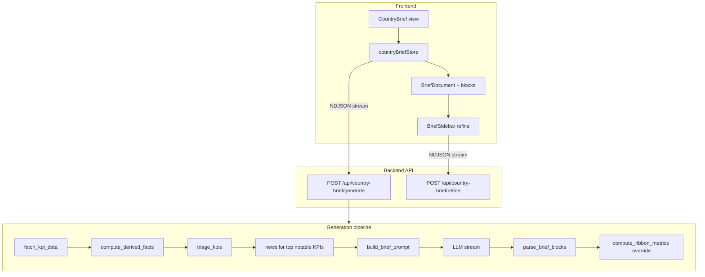

# ADR-003: Country Brief Page and Automated Brief Generation

**Status:** Accepted

**Date:** 2026-04-07

**Authors:** Johann Sylvester, AI Assistant

---

## Context

Macrobrief needs a **Country Brief** experience that turns Oxford Economics KPI data (via Knoema) into a **single executive-ready narrative** about a nation’s macro performance—not a disjointed list of per-indicator commentary.

The overhaul introduces:

- A dedicated **Country Brief** route with country/time-range selection and optional **analyst focus** (themes to emphasize).
- A **server-side generation pipeline** that fetches data, scores relevance, pulls **news context** for the most notable indicators, and calls an LLM with a **strict document contract** (markers in the model output).
- A **block-based UI** that renders structured content (headline ribbon, executive summary, themed sections with inline charts, forward outlook) and supports **section-level refinement** via chat.

This ADR records the architectural choices behind that design and how they combine into a coherent “unified picture” of national performance.

---

## Decision Records

### DR-1: Block-Based Brief Contract (Markers + Server Parse)

**Options presented:**

| Option | Description |
|--------|-------------|
| (a) | Free-form markdown only; frontend renders one blob |
| (b) | LLM emits tagged sections (`[EXEC_SUMMARY]`, `[SECTION:…]`, `[CHART:kpi_id]`, etc.); server parses into typed JSON blocks |
| (c) | Multi-step LLM calls per section with separate API round-trips |

**Chosen:** **(b)** — One generation pass with **explicit markers**, then `parse_brief_blocks()` in `backend/routers/country_brief.py` converts raw text into a list of blocks: `metrics_ribbon`, `executive_summary`, `section` (with `narrative` and `chart_ref` children), `outlook`.

**Rationale:** A single pass with a fixed structure keeps latency and cost predictable while still allowing **narrative flow** inside sections. Typed blocks let the React layer use **purpose-built components** (ribbon, charts, discuss/refine hooks) instead of one generic markdown canvas. Option (c) would multiply LLM calls and complicate consistency across sections.

**Consequences:**

- Prompt changes must stay aligned with the regex parser; malformed or renamed markers degrade parsing.
- The system prompt in `backend/prompts/brief_prompts.py` is the **source of truth** for output shape.

---

### DR-2: NDJSON Streaming for Generation UX

**Options presented:**

| Option | Description |
|--------|-------------|
| (a) | POST returns complete JSON after full pipeline (no streaming) |
| (b) | Stream **newline-delimited JSON** events: status, data payloads, text deltas, final blocks |

**Chosen:** **(b)** — `POST /api/country-brief/generate` returns `StreamingResponse` with `media_type="application/x-ndjson"`. Events include at least: `status`, `kpi_data`, `triage`, `text_delta`, `blocks`, `done`.

**Rationale:** Users see **phase feedback** (fetching, analyzing, news, generating) and a **live text preview** while the model streams. The client caches `kpi_data` early so charts can render as soon as blocks arrive.

**Consequences:**

- Client must implement robust line buffering (`countryBriefStore.js`) for partial chunks.
- Errors mid-stream require clear HTTP error handling before the stream starts.

---

### DR-3: Pipeline Order — Data First, Then Triage, Then News, Then Narrative

**Chosen sequence:**

1. **Fetch** all Oxford-sourced KPI series for the country and window (`fetch_kpi_data`).
2. **Derive facts** (`compute_derived_facts`) from series actually returned.
3. **Triage** KPIs (`triage_kpis`) to mark **notable** vs filtered; expose scores to the UI (`TriagePanel`).
4. **News:** for up to **5** notable KPI IDs, fetch and synthesize news (`fetch_news_for_kpi`, `synthesize_news_context`); cap merged articles per country.
5. **Prompt:** `build_brief_prompt` injects **filtered** results/facts for notable IDs, **per-KPI insight lenses** (`INSIGHT_LENSES`), optional `NEWS_CONTEXT`, optional **focus** string.
6. **Stream** LLM completion; on completion, **parse** markers into blocks.

**Rationale:** The model only sees **high-signal** KPIs and supporting lenses, reducing noise and token load. News is **scoped** to notable themes so the narrative stays tied to what the data flags as important—supporting a unified story rather than generic commentary.

**Consequences:**

- Triage quality directly affects brief quality; changes to scoring ripple to prompts and news volume.
- Non-notable KPIs may be omitted from `DATA_CONTEXT` even if raw data existed.

---

### DR-4: Computed Metrics Ribbon Overrides the LLM Ribbon

**Options presented:**

| Option | Description |
|--------|-------------|
| (a) | Trust the model’s `[METRICS_RIBBON]` for values and trend arrows |
| (b) | Parse the LLM ribbon but **replace** it with `compute_ribbon_metrics(derived_facts)` |

**Chosen:** **(b)** — After parsing, any `metrics_ribbon` block from the model is removed and replaced by server-computed metrics so **values and direction labels match actual series math** (documented in code: LLMs often mis-order trends).

**Rationale:** The brief must be **credibly grounded** in the same numbers as the dashboard; headline figures are the highest-visibility surface for errors.

**Consequences:**

- Ribbon layout/labels are governed by `metrics_ribbon.py`, not the model’s table formatting.
- The model’s ribbon block is effectively a fallback that is routinely discarded when computed metrics exist.

---

### DR-5: Inline Charts via `[CHART:kpi_id]` + Client-Side Series Cache

**Chosen approach:** The LLM places `[CHART:kpi_id]` markers **inside section bodies**. The parser splits each section into alternating `narrative` and `chart_ref` blocks. The frontend **`kpiDataCache`** (populated from the `kpi_data` NDJSON event) feeds `InlineChartBlock` so charts align with the **same fetched series** used for generation.

**Rationale:** Charts appear **where the narrative needs evidence**, not in a separate appendix—reinforcing one integrated story. Using server-fetched data avoids client-side re-query during read.

**Consequences:**

- Invalid or missing `kpi_id` in a marker may produce empty or error states in chart components.
- Chart placement quality depends on prompt adherence.

---

### DR-6: System Prompt Design — Integrated Narrative, Not KPI Laundry Lists

**Chosen rules** (see `BRIEF_SYSTEM_PROMPT`): require **synthesis across KPIs**, forbid mechanical listing, require numeric claims to trace to `DATA_CONTEXT`, allow **omitting** whole sections if data is absent or unremarkable, and supply **writing quality constraints** (banned vague phrases, formatting rules).

Optional **user focus** (`FOCUS_ADDENDUM_TEMPLATE`) steers depth toward analyst-specified themes without discarding other notable threads.

**Rationale:** Executive briefs are **stories with evidence**, not catalogs. Omission of weak sections is explicitly preferred over filler.

---

### DR-7: Section Refinement — Separate Endpoint, Grounded in Data Context

**Chosen approach:** `POST /api/country-brief/refine` streams NDJSON (`text`, `done`). The sidebar sends **current section text**, a **trimmed `kpi_data` slice** as `data_context`, user **message**, and **history**. **Apply revision** updates the corresponding block in Zustand (`updateBlockContent`).

**Rationale:** Refinement is **localized** (cheaper, safer) and **grounded** (system prompt insists on factual discipline). Users opt in to replacing section text after reviewing the assistant output.

**Consequences:**

- Refine context is a subset of full KPI data; deep edits may need regenerate instead.
- Block index addressing must stay consistent with how `BriefDocument` maps sections to store indices.

---

### DR-8: Workspace Persistence — Selection, Not Full Brief Snapshot

**Chosen approach:** `country_brief` on the workspace stores **country**, **startYear**, **endYear**, **focus** (`WorkspaceShell` debounced sync). `hydrateFromWorkspace` restores those fields but **does not** reload generated `blocks`; the user **regenerates** after switching workspaces.

**Rationale:** Generated prose is **large**, **stale**, and **non-deterministic**; persisting it would bloat storage and confuse version semantics. Persisting **intent** (who/when/what focus) is enough for continuity.

**Consequences:**

- Switching workspaces does not restore a previously generated brief body without a new generation (by design).

---

### DR-9: KPI Triage — Deterministic Scoring

Triage is implemented in `backend/services/kpi_triage.py` and runs on **derived facts** from `compute_derived_facts()` (`backend/services/derived_facts.py`): per-series CAGR, period-over-period changes, inflection points, trend segments, and reversals.

For each KPI, `score_kpi()` accumulates a numeric **score** from each non-note series fact:

| Signal | Role in scoring |
|--------|-----------------|
| **CAGR vs “boring” floor** | Per-KPI thresholds (e.g. population `9`: 2%, unemployment `5`: 1 pp, consumption `6`: 3%, default **1.5%**). If \(\|CAGR\|\) exceeds the floor, add a bonus capped by ratio to that floor (up to **+5** from this line). |
| **Negative CAGR** | If CAGR &lt; **−1%**, add **+2**. |
| **Inflection points** | **+1.5** each, capped at **+6** from inflections. |
| **Trend reversals** | **+1** per reversal between adjacent trend segments. |
| **Latest period jump** | If \(\|change\_pct\|\) vs prior period **> 10%**, add **+1.5**. |
| **GDP family** | KPIs **1, 2, 3** get a flat **+1** base boost. |

A KPI is **`notable`** if **`score >= 3.0`**. Then **`triage_kpis()`** enforces bounds:

- **`min_notable = 3`:** If fewer than three pass, the next-highest scorers are **promoted** (reason: `"promoted (min-notable)"`) so the brief always has enough material.
- **`max_notable = 7`:** If more than seven are notable, excess are **demoted** from the bottom of the notable set.

Results are returned **sorted by score descending** (for `TriagePanel` and downstream ordering). **`notable_kpi_ids`** controls which rows enter `DATA_CONTEXT`, which **`INSIGHT_LENSES`** blocks are attached in `build_brief_prompt`, and which KPIs are eligible for the **news** loop (**first five** IDs in that score-sorted notable list in `country_brief.py`). The LLM does **not** perform triage—scoring is fully rule-based.

---

### DR-10: Thematic Sections — Fixed Menu, LLM Chooses Subset

The **`BRIEF_SYSTEM_PROMPT`** (`backend/prompts/brief_prompts.py`) defines a **fixed set** of thematic section titles (e.g. Economic Performance & Growth, Investment & External Position, Prices Employment & Domestic Demand, Demographics & Structural Factors) using the `[SECTION:Title]…[/SECTION]` marker pattern.

**Who includes which sections:** The model is instructed to **omit** entire sections when underlying KPIs are absent or unremarkable. It does so by **not emitting** the corresponding section block. There is **no** server-side step that removes sections based on triage scores; `parse_brief_blocks()` only extracts whatever `[SECTION:…]…[/SECTION]` pairs appear in the raw LLM output.

**Net:** Section **names** are **prescribed by the prompt** (a closed menu). **Which** of those sections appear is **decided by the LLM** at generation time. If the model emitted a non-canonical title inside the marker, the parser would still surface it—the contract is **prompt-enforced**, not schema-validated.

---

## Architecture Summary

**Unified picture:** Data fetch and triage define **what matters**; lenses and prompts force **cross-KPI synthesis**; news adds **real-world grounding** for notable themes; computed ribbon and inline charts tie the **narrative to verifiable series**; optional focus and section refine add **human steering** without fragmenting the document model.

---

## References

- `backend/services/kpi_triage.py` — KPI scoring, min/max notable, promotion/demotion
- `backend/services/derived_facts.py` — facts fed into triage
- `backend/models/kpi_registry.py` — `INSIGHT_LENSES`, KPI catalogue
- `backend/routers/country_brief.py` — streaming endpoint, parsing, ribbon override
- `backend/prompts/brief_prompts.py` — system/user prompts, refine prompts
- `frontend/src/views/CountryBrief/CountryBrief.jsx` — page layout and block rendering
- `frontend/src/stores/countryBriefStore.js` — NDJSON client, state
- `frontend/src/WorkspaceShell.jsx` — workspace hydration and `country_brief` sync
- ADR-001 — Newscatcher and news-data fusion (feeds news steps in this pipeline)
