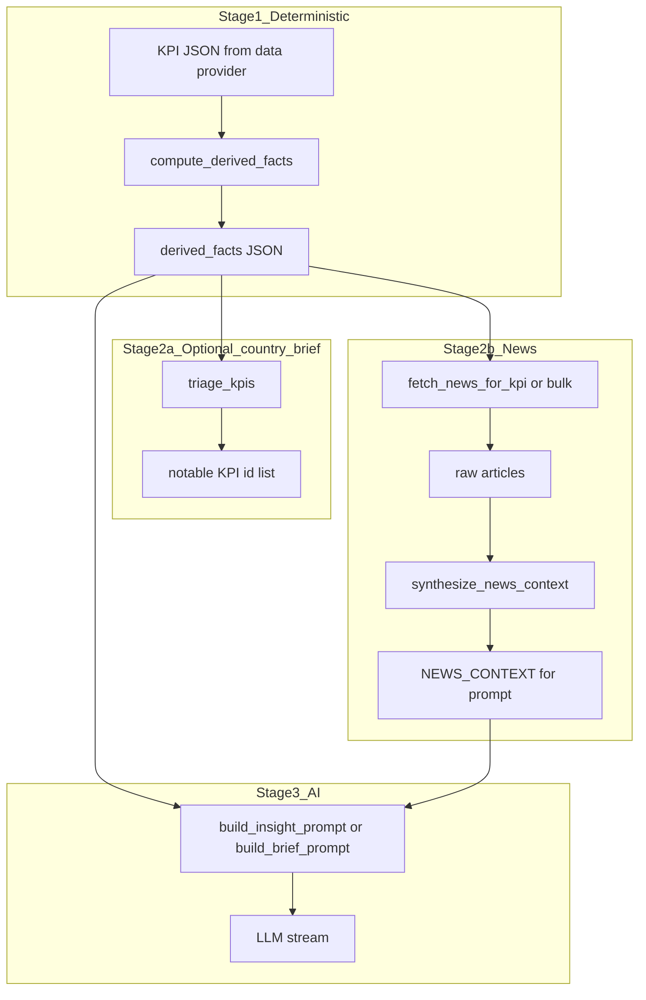

# 06 — End-to-end pipeline (layman walkthrough)

This page ties the numbered docs together: **what goes in**, **what comes out**, whether each step is **deterministic code** or **AI**, and **why** the handoff looks the way it does. For jargon, each topic doc also has a **Glossary** section.

**Related:** [01](01-derived-facts-and-inflections.md) · [02](02-kpi-notability-scoring.md) · [03](03-newscatcher-and-queries.md) · [04](04-article-scoring-and-filtering.md) · [05](05-dashboard-prompts-and-lenses.md)

---

## Big picture

The product does three sensible things in order:

1. **Summarize the raw KPI time series** into compact statistics humans (and the LLM) can reason about — without inventing numbers.
2. **Optionally pull news** that overlaps the same calendar window and **rank** articles so the model does not drown in noise.
3. **Ask a large language model** to write text — but only after we have locked the **data** and **article list** into a structured prompt.

Nothing in steps 1–2 uses machine learning inside *our* codebase: it is arithmetic, rules, HTTP calls, and weighted scores. The **only** “AI” step is the final LLM call (and optional refine/chat elsewhere).

---

## Stage 1 — Derived facts

|                   |                                                                                                                                                                                                                                   |
| ----------------- | --------------------------------------------------------------------------------------------------------------------------------------------------------------------------------------------------------------------------------- |
| **Input**         | `results`: list of KPI result dicts from the app (each has `kpi_id`, `kpi_name`, `series[]` with dated `points`).                                                                                                                 |
| **Processing**    | **100% deterministic.** Python loops over points, sorts by date, computes changes, CAGR, which steps count as “inflections”, and trend segments. Same input always yields the same output.                                        |
| **Output**        | `derived_facts`: nested JSON (per KPI → per series → fields like `cagr`, `period_over_period`, `inflection_points`, `trend_segments`).                                                                                            |
| **Why it exists** | Raw series are long and noisy. This stage **compresses** them into a structured summary so the LLM can follow rules like “cite only numbers that appear in derived_facts”.                                                        |
| **Next consumer** | **Dashboard insights:** merged into `DATA_CONTEXT` and sent to the LLM. **News:** date range for Newscatcher is derived from earliest/latest dates inside these facts. **Country brief:** same facts feed KPI notability scoring. |

**Layman analogy:** You hand someone a spreadsheet of monthly GDP; this stage is the analyst who highlights “average growth per year”, “biggest jump”, and “when the direction flipped” — without interpreting *why* anything happened.

**Detail:** [01 — Derived facts & inflections](01-derived-facts-and-inflections.md)

---

## Stage 2a — KPI notability (country brief only)

|                       |                                                                                                                                                                                                                                                                                                    |
| --------------------- | -------------------------------------------------------------------------------------------------------------------------------------------------------------------------------------------------------------------------------------------------------------------------------------------------- |
| **Input**             | The same `derived_facts` list as above (one object per KPI).                                                                                                                                                                                                                                       |
| **Processing**        | **Deterministic.** Each KPI gets a **numeric score** by adding fixed bonuses when the data look “interesting” (big CAGR vs a KPI-specific bar, inflections, trend reversals, large latest change, plus a GDP-family boost). Then **triage** may force at least 3 KPIs to be “notable” or cap at 7. |
| **Output**            | Ordered list of `KpiScore` objects, each with `notable: true/false`. The brief pipeline keeps only KPIs with `notable == true` for narrative focus (subject to min/max rules).                                                                                                                     |
| **Why it exists**     | A country can have 10 KPIs; writing about all of them is unreadable. This stage picks **which** KPIs deserve space in the brief.                                                                                                                                                                   |
| **Does not apply to** | Single-KPI dashboard insight streams — those use the KPIs the user already selected; triage is not applied there.                                                                                                                                                                                  |

**Layman analogy:** A newspaper editor ranking story pitches: “these three themes matter most for this country this decade.”

**Detail:** [02 — KPI notability scoring](02-kpi-notability-scoring.md)

---

## Stage 2b — News retrieval and ranking

### 2b-i Fetch

|                |                                                                                                                                                                                                                       |
| -------------- | --------------------------------------------------------------------------------------------------------------------------------------------------------------------------------------------------------------------- |
| **Input**      | **Dashboard:** `kpi_id`(s), ISO3 countries, and `derived_facts` (for date window). **Bulk:** all selected KPI ids + countries + `derived_facts`.                                                                      |
| **Processing** | **Deterministic HTTP.** Build a text query from `[KPI_NEWS_QUERIES](../../backend/models/kpi_registry.py)`, resolve country names, clamp dates to API limits, POST to Newscatcher. Results may be cached for an hour. |
| **Output**     | Raw article dicts (title, body/snippet, NLP fields, rank, dates…).                                                                                                                                                    |

### 2b-ii Score and package

|                   |                                                                                                                                                                                                                                                  |
| ----------------- | ------------------------------------------------------------------------------------------------------------------------------------------------------------------------------------------------------------------------------------------------ |
| **Input**         | Raw articles + countries + primary `kpi_id` (and optional multi-KPI `signal_terms`).                                                                                                                                                             |
| **Processing**    | **Deterministic.** Drop short articles; compute weighted score (country match + keyword match + source rank + recency + “info richness”); deduplicate similar titles; trim to a per-country cap; attach optional period / near-inflection flags. |
| **Output**        | `news_context`: buckets per country ISO3 plus sometimes `_general`, each item a small card (`title`, `snippet`, `score`, `n` index for citations).                                                                                               |
| **Next consumer** | `build_insight_prompt` / `build_brief_prompt` inject this as `NEWS_CONTEXT` JSON so the model can cite `[src:N]`.                                                                                                                                |

**Layman analogy:** Google search returns thousands of links; this stage is “keep articles that mention the country, match economic keywords, look reputable, are recent enough, and aren’t duplicates — then take the top N.”

**Detail:** [03](03-newscatcher-and-queries.md) · [04](04-article-scoring-and-filtering.md)

---

## Stage 3 — Prompt assembly and LLM

|                |                                                                                                                                                                                                                 |
| -------------- | --------------------------------------------------------------------------------------------------------------------------------------------------------------------------------------------------------------- |
| **Input**      | `selection` (countries, kpi_ids), raw `results`, `derived_facts`, optional `news_context` / flattened article bundle. For country brief: **notable** KPI ids and filtered results.                              |
| **Processing** | **Deterministic string building:** system prompt + user JSON + per-KPI **lenses** from the registry + instructions for sections and citation markers.                                                           |
| **Output**     | Messages sent to the chat-completions API; streamed text for the UI.                                                                                                                                            |
| **AI role**    | The model **generates prose** under strict rules: numbers and facts in Summary/Key Findings must come from `DATA_CONTEXT`; Implications may combine data + news + general knowledge as described in the prompt. |

**Layman analogy:** You give a briefing assistant a slide deck (the JSON) and a clipping file (news). The assistant writes the memo; they are not allowed to invent statistics that are not on the slides.

**Detail:** [05 — Prompts & KPI lenses](05-dashboard-prompts-and-lenses.md)

---

## Where “causality” is decided

There is **no** separate automated “this article caused this KPI move” engine in this path (that would be Insights Lab, out of scope here). Instead:

- The **prompt** tells the model how to argue causally and to prefer **news-backed** explanations when `NEWS_CONTEXT` is present.
- The human reader should treat causal language as **model inference** guided by rules, not as econometric proof.

---

## Quick glossary (cross-doc)

| Term                          | Plain English                                                                                                                              |
| ----------------------------- | ------------------------------------------------------------------------------------------------------------------------------------------ |
| **KPI**                       | One macro indicator the app can chart (GDP, FDI, etc.), identified by an id like `"4"`.                                                    |
| **Series**                    | One line on the chart — usually one country × one sub-indicator (e.g. inward FDI for SAU).                                                 |
| **PoP / period over period**  | Change from one published period to the next along the time series (quarter to quarter or year to year, depending on data frequency).      |
| **CAGR**                      | Smooth annualized growth rate over the **whole** time window in the chart — useful for “typical” long-run pace.                            |
| **Inflection**                | A period where the series did something unusual: direction flip vs previous period, or a move larger than a data-driven threshold.         |
| **Derived facts**             | All of the above, precomputed JSON — **not** news, **not** scores.                                                                         |
| **Notability score**          | A **separate** single number per KPI used only to choose which KPIs get emphasis in the **country brief** — not the same as article score. |
| **Article / composite score** | How well a news article matches country + keywords + quality + recency before we show it to the LLM.                                       |
| **Lens**                      | Per-KPI instructions in the prompt (“what counts as interesting”, “forbidden claims”).                                                     |

---

## Wiring reference (where to read code)

| Flow                        | File                                                                         | Function                                                      |
| --------------------------- | ---------------------------------------------------------------------------- | ------------------------------------------------------------- |
| Dashboard multi-KPI insight | `[backend/services/agent.py](../../backend/services/agent.py)`               | `stream_multi_kpi_insight`                                    |
| Dashboard single KPI        | same                                                                         | `stream_kpi_insight`, `stream_single_country_kpi_insight`     |
| Cross-country               | same                                                                         | `stream_cross_country_insight`                                |
| News Lab (no LLM)           | `[backend/routers/insights.py](../../backend/routers/insights.py)`           | `news_lab`                                                    |
| Country brief               | `[backend/routers/country_brief.py](../../backend/routers/country_brief.py)` | `generate` stream — triage → bulk news → `build_brief_prompt` |

When in doubt, search for `compute_derived_facts` and `synthesize_news_context` in `agent.py` and `country_brief.py` to see exact argument order and caps.