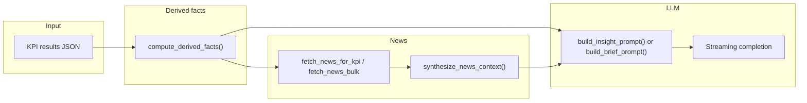

# Insights pipeline (reference)

This folder documents how **dashboard insights** and **shared news fusion** work in the `backend/` package: KPI-derived statistics, Newscatcher retrieval, article scoring, and LLM prompts (including per-KPI lenses). It does **not** cover the separate Insights Lab pipeline.

## Documentation build

| Field | Value |
|--------|--------|
| Git commit | `ce49207fc3ac58a63b3d44a528fd0f57057a2eb7` |
| Commit date | 2026-04-07 22:37:18 +0530 |

Re-run `git rev-parse HEAD` after code changes; line numbers in child pages refer to this commit.

## Out of scope

- [`backend/insights_lab/`](../../backend/insights_lab/) — not documented here.
- [`old_insights/`](../../old_insights/) — not documented here.
- Root [`main_api.py`](../../main_api.py) — treated as legacy; canonical behavior is under `backend/`.

## Architecture decision record

Design rationale for Newscatcher NLP, clustering, and fusion tradeoffs (supplements the verbatim code in this folder): [ADR-001: Newscatcher integration and news-data fusion](../adr/001-newscatcher-news-data-fusion.md). Topic pages [03](03-newscatcher-and-queries.md), [04](04-article-scoring-and-filtering.md), and [05](05-dashboard-prompts-and-lenses.md) cross-link the ADR where behavior matches.

## Top-level flow

**Call sites (dashboard):** [`backend/services/agent.py`](../../backend/services/agent.py) computes `derived_facts`, fetches news, synthesizes context, and calls `build_insight_prompt` / `build_cross_country_prompt`. **News Lab UI:** [`backend/routers/insights.py`](../../backend/routers/insights.py) `POST /api/news/lab` exposes scored articles without running the LLM.

## Pages

| Page | Contents |
|------|----------|
| [01 — Derived facts & inflections](01-derived-facts-and-inflections.md) | `compute_derived_facts`: CAGR, PoP, inflections, trend segments |
| [02 — KPI notability scoring](02-kpi-notability-scoring.md) | Country-brief triage: `score_kpi`, `triage_kpis` |
| [03 — Newscatcher & queries](03-newscatcher-and-queries.md) | API defaults, dates, `KPI_NEWS_QUERIES`, bulk mega-query |
| [04 — Article scoring & filtering](04-article-scoring-and-filtering.md) | Composite score, filters, caps, period alignment, `/news/lab` messages |
| [05 — Prompts & KPI lenses](05-dashboard-prompts-and-lenses.md) | `SYSTEM_PROMPT`, insight/cross-country builders, `INSIGHT_LENSES`, country brief system prompt |

## Causal narrative (dashboard)

There is **no** separate signal-to-event JSON matcher in this path. Causal chains are instructed in the **system prompt** (especially **Implications**) and optionally grounded with **`NEWS_CONTEXT`** and `[src:N]` markers. See [05 — Prompts & KPI lenses](05-dashboard-prompts-and-lenses.md).
